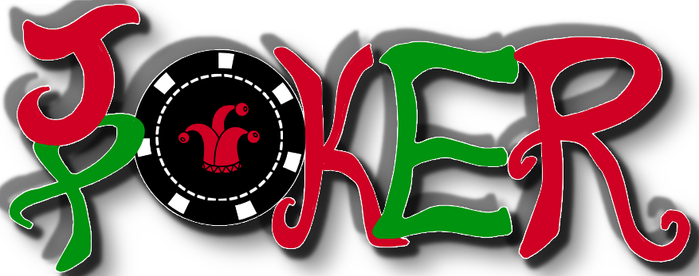

# GA Project 1

## 1. Idea

For my Project I have taken inspiration from a game that I love called Balatro. It takes the idea of poker and transforms it into a single player game with a lot of unique twists. It has the same hands as poker such as Flush and Straight. However, instead of playing against a dealer or another player,you play against Blinds and Bosses and have to clear rounds by earning enough points. Every hand has varying multipliers and different cards have different points. There are also special cards called Jokers that provide special bonuses.

### Antes

Each set of 3 rounds is called an Ante. Each round is described below:

1. First Round - Small Blind

- The easisest round in the Ante with the lowest point requirement.

2. Second Round - Big Blind

- Has a slightly higher point requirement.

3. Boss Round

- This round has the highest point requirement in the Ante and will have some conditions for the player to fulfil such as spades having lower points or being only allowed to play one type of hand.

**Note**:In the original game there are 8 Antes but for the sake of simplicity and the vastly lesser amount of Jokers, there will only be 3 Antes and a Bonus Boss Ante.

### Jokers

There are over 100 Jokers in the original game but for simplicity, I will include 12 Jokers each providing a different bonus. The Jokers do not affect the main gameplay,but rather affect the multipliers and points. You will be able to have the effects of 2 jokers at most at all times. After each round three random jokers will be shown you may pick 1 to keep. If you already have 2 jokers you will have to select 1 to discard. If you fulfil the requirements, the special joker is guaranteed to show up.

**Jokers**

1. Classic Joker - Adds a x4 multiplier.
2. Red Rage Joker - If the winning hand contains atleast 3 red cards the add 20 points per red card.
3. Half Joker - If your winning hand has 3 or less cards add x15 to the multiplier.
4. Gigachad Joker - If your played hand is a Straight or Full House, for each card in the winning hand add the value of the highest card.
5. Toilet Joker - If your played hand is a Flush or Straight Flush or Royal Flush, add x10 to the multiplier.
6. Knightly Joker - If your winning hand contains face cards(Including Ace), all winning cards are worth 21 points.
7. Ghastly Joker - If you are in a Boss Round, `x1.5` your final multiplier value.
8. Dogg Joker - All cards take the value of the 'highest' card in your entire hand. (Not just the played hand)
9. The World Joker - Allows you to have two extra hands this round.
10. Brimstone Joker - Allows you to have two extra discards this round.

**Special Jokers**

These two jokers can only be found if you complete Ante 3.

1. Negative Joker - All card played count towards the points calculation of the winning hand. Adds x2 multiplier for each discard and hand left in this round.
2. God Joker - `x5` your final multiplier value. Add 50 points for each card in winning hand.

## Bosses

In the original game there are over 80 different bosses but again,for simplicity there will only be 5 different possible bosses and 2 possible bosses for the Bonus Round.

**Bosses**

1. The Wall - The point requirement for this round is 1.5 times higher than the usual for this Ante.
2. I love Twos - You can only play Pairs or Two Pairs this round.
3. HeartBreak - Heart cards have no value this round.
4. Braille - Face cards (including Ace) will not be revealed.
5. Good Luck - You have one less hand and one more discard this round.

**Special Bosses**

1. No Money for a Suit - Suits will not be revealed.
2. Insider Trading - For each hand you play, your total points are reduced by 10%.

## Hands and Multipliers

Each card has a point value accompanying it starting from 2 and each face card being 10 and Ace being 11.
You begin each round with a deck of 52 and 10 cards to form your hand from. Only the winning cards that form the highest multiplier count towards your points. Each type of hand has a different multiplier value.

The winning hands are the same as in poker with the multiplier being as follows:

**Hands**

1. High Card - x1
2. Pair - x2
3. Two Pair - x4
4. Three of a Kind - x5
5. Straight - x7
6. Flush - x8
7. Full House - x10
8. Four of a Kind - x12
9. Straight Flush - x15
10. Royal Flush - x30

Every Round you start with 5 Hands and 5 Discards. You are allowed to play 5 different hands and discard 5 times. Each hand or discard you are allowed to pick 5 cards to play or discard.

**_PS:I know this is a huge project involving a lot of functions but I'll try my best_**

## 2. Pseudocode

```js
Steps:
1. Initialize Deck Array
2. Create Card Object/Class
3. Create Arrays to store Hands and Cards in Play
4. Create Arrays to store Bosses and Jokers
5. Create Boss Objects with functions
6. Create Joker Objects with functions
7. Create Round Counter
8. Create Point and Multiplier Counters
9. Create Hand and Discard Counters
10. Assemble all functions and objects into singular functions.
11. Add eventListeners and constants for the HTML queries
12. Test
```

```js
How it should work:
Game Initializes
Round 1 Ante 1 starts -Small Blind
10 cards chosen from deck - pick up to 5 to play or discard
Within 5 hands + 5 discards hit point requirement else lose
Display leaderboard to enter name and points accumulated in LB
After round end pick 1 out of 3 jokers
repeat until boss round of Ante 1
Apply Special conditions to Boss round
if win continue to Ante 2
repeat until Ante 3 boss clear
Display Win Message
Ask if want to play Bonus Boss
enter Bonus Round
-If clear Display Win
Retry Button + Leaderboard Name
```
---------------------------------------------------------------------------------------------------
[GAME LINK](https://manxzo.github.io/Project-1/)
## Comments and references
So for my code , I got the logic working for the most part, except some parts where I misplaces the code positioning an usually fixed it with the console.
A few things I would like to improve on is organising my code better and making my code more readable. 
- I had to use AI for formatting at one point of time as my code was too messy and searching for references was too difficult.
- I also used AI for commenting which I did not include in the finished code. 

**There was two cases where I used AI for JS code to troubleshoot when I got completely stuck.(I only used it as a last resort)**
1. I was stuck when I couldnt update my jokers dynamically and had to ask AI for how to find the positioning of my joker element and match it to the right joker as my jokers are kept in ```const jokersInPlay :{idOne:"",idTwo:""}```.The fix for this was to move the remaining joker to jokeridOne everytime I remove a joker so that the joker is always in the right positioning.
2. The other case was when I was having issues with my bosses - specifically the braille and No Money for a suit Bosses, not updating my cards properly to hidden. Turns out my issue was I was applying them to the deck itself and not the hands/table.
Most of the time if i didnt know the code to perform a function I just googled for it and learnt how the function worked - eg. Deep cloning an array with JSON.stringify
As for the images , the logo and the boss image is drawn by me while the joker images are AI generated. I had drawn 3 cards but could not finish drawing all of them in time so I used them as placeholders.

**For css, I used AI to convert my font sizes from px to em for scalability and I was unsure of how much to use for each case**
Apart from that , I used AI to learn styling for css by providing it with prompts for what I needed and asking how I can style it. -eg.using nth child to enforce flexbox styling or white-space to allow me to use `\n` in JS.

**Things To Improve**
1. Better Readability
2. Organizing code
3. Proper commenting


